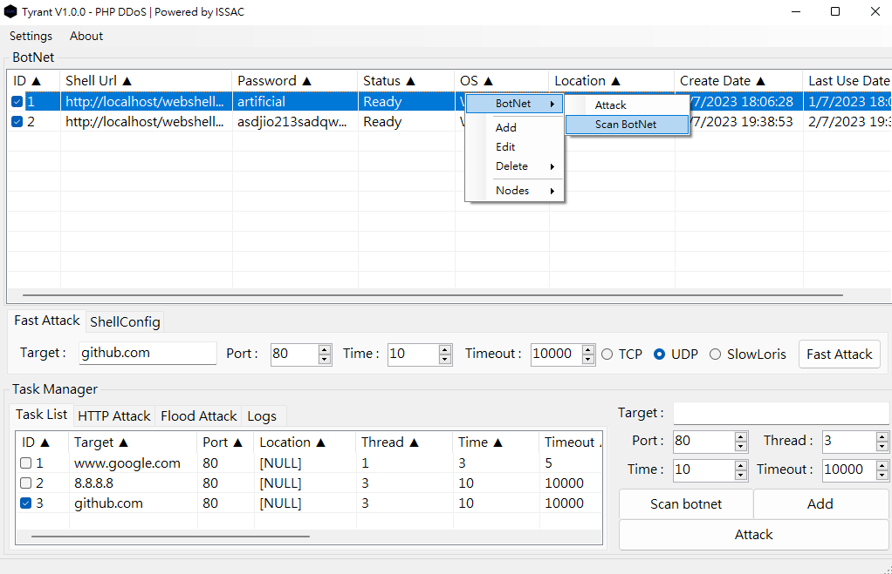
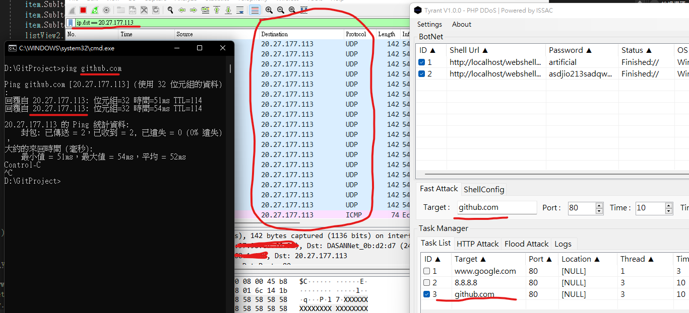

# Tyrant
## 簡介
Tyrant DDoS是一個運用PHP一句話木馬進行壓力測試的工具，透過把指定的Payload注入到eval函數來執行程式。

## 免責聲明!!!!!
工具只限用於學習、壓力測試等合法用途，如非法使用則後果自負

## 目的
為甚麼我會寫這個工具呢? 我一開始是因為DDoS才會對資訊安全(OR網絡安全)感到興趣，在我剛接觸資訊安全領域時，身邊有很多人都會使用LOIC等工具進行惡作劇和攻撃，然後聲稱這是DDoS，後來我才明白這根本不是甚麼DDoS，只是簡單的DDoS而已，不知道是對DDoS的定義有甚麼誤會還是單純因為DDoS聽上去比較帥和比較強，大家都會說這是DDoS。   
我很不喜歡這樣，對這件事有點不爽，剛好我最近也看了幾篇DDoS技術原理的文章，再加上我編寫Alien時的經驗和一個想法———使用一句話木馬進行DDoS，所以就寫了這個工具，附合DDoS定義的DDoS，這聽上去很奇怪，但這是事實。   
這工具也是一個Proof of Concept，目前有很多DDoS工具都是用使TCP ReverseShell、P2P、IRC建立的，這個工具也有一個目的就是證明可以不使用這三種方法，而是使用HTTP就能建立BotNet。

## Screenshot

