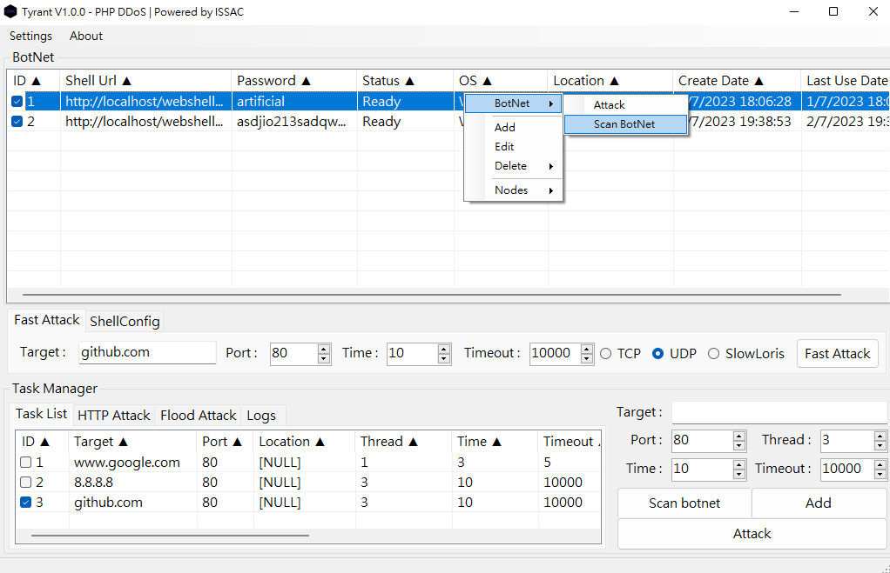
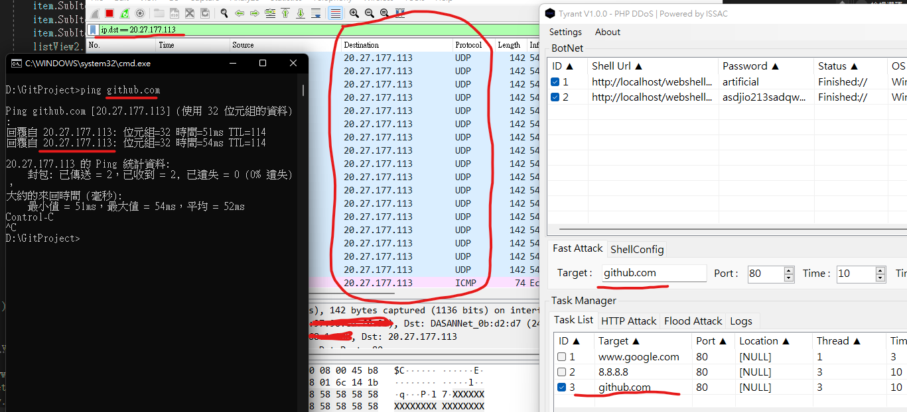

# Tyrant
Tyrant is a proof of concept that demonstrates how a botnet-based DDoS attack can be established through a PHP web shell.

# Disclaimer
This project was developed as part of my personal interest in studying cybersecurity. However, it may potentially be misused for malicious purposes.
Please do NOT use this tool for any illegal activities.

# Screenshot

